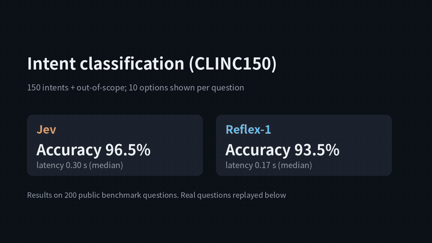
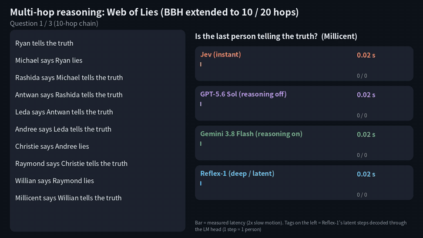
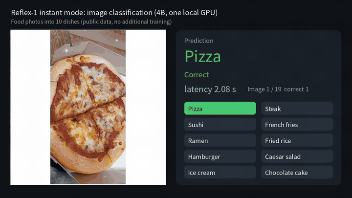

# Reflex-1

**Frontier-LLM accuracy at Jev speed. A 4B open model.**

Reflex-1 is a decision model for routing, guardrails and classification. It returns a choice with probabilities instead of generated text:

- **Classification (`instant`)** — answers in the same accuracy band as frontier LLMs such as GPT-5.6 and Gemini 3.8, faster than the dedicated judgment API Jev. No training needed. Text and images.
- **Reasoning (`deep`)** — once trained on a judgment, Reflex-1 reaches frontier-level accuracy on decisions that require reasoning, in about a second. It uses **latent reasoning**: the model reasons internally instead of writing its reasoning out as text, and each step can be decoded back into words (`trace`).

[](https://colab.research.google.com/github/matu79go/reflex-1/blob/main/notebooks/quickstart.ipynb)
[](https://huggingface.co/matu79go/Reflex-1-4B)

Weights: [huggingface.co/matu79go/Reflex-1-4B](https://huggingface.co/matu79go/Reflex-1-4B) · Base model: Google Gemma 4 E4B (Apache 2.0)

## Demos

**Instant classification vs Jev** — the options the models actually saw; a tag appears the moment each model answers ([full video](media/instant_classification.mp4))



**Reasoning: frontier LLMs, Jev and Reflex-1** — a 10-person chain of liars; tags on the left are Reflex-1's latent steps decoded into words ([full video](media/reasoning_race.mp4))



**Image classification** — CC0 / public-domain photos from Wikimedia Commons, about 0.3 s each ([full video](media/image_classification.mp4))



## Results

| | Frontier LLM (GPT-5.6 / Gemini 3.8) | Jev | **Reflex-1** |
|---|---|---|---|
| Classification, mean of 5 public benchmarks | 85.6 / 84.8 | 83.6 | **84.2** |
| Median latency per decision | 1.24 s / 2.28 s | 0.30 s | **0.10 s** |
| Reasoning, mean of 5 trained logic tasks | 55.2 (reasoning off) / 100 (reasoning on) | 68.1 | **84.6** |
| Median latency, reasoning | 1.2 s / 2.9 s | 0.30 s | **0.9 s** |
| Image input | yes | no | **yes (~0.3 s)** |
| Runs locally | no | no | **yes, 9.8 GB at 4-bit** |

Classification: CLINC150 intent, MASSIVE ja-JP intent, tweet_eval emotion and sentiment, Civil Comments insult. Reasoning: BIG-Bench Hard web_of_lies (10 and 20 people), object tracking (7 people, 14 swaps), boolean expressions, navigation. Reflex-1 measured on one NVIDIA GB10 (GX10), sequentially; Jev and frontier LLMs via OpenRouter, network included. Full tables in the blog post.

## Install

```bash
git clone https://github.com/matu79go/reflex-1.git
cd reflex-1
pip install -r requirements.txt
```

Requirements: an NVIDIA GPU with bfloat16 support and about 12 GB of free memory (4-bit). Tested on NVIDIA GB10 (aarch64, CUDA 13).

## Run the endpoint

```bash
python -m reflex.server --skills skills.json --port 8097 --quant nf4
```

The skill adapters listed in `skills.json` are downloaded from the Hugging Face Hub on first start. Omit `--skills` to run classification only.

## API

`POST /v1/decisions`. The request shape is compatible with Jev (`state`, `questions`, `instructions`, `criteria`, `type: "choice"`). Fields marked ★ are Reflex-1 extensions.

| Field | Meaning |
|---|---|
| `state` | The input: a string or any JSON object |
| `questions` | `{name: {type, instructions, criteria}}`. Each question is answered independently |
| `type` | `"choice"` (pick one of `criteria`) or ★ `"text"` (free text, `max_tokens`) |
| `criteria` | `{option: description}`. Descriptions may be empty |
| ★ `image` | Base64 image (or data URL) for image classification |
| ★ `mode` | `"instant"` (default) or `"deep"` |
| ★ `skill` | Skill name for `deep` (see `skills.json`) |
| ★ `steps` | Number of latent steps; default counts them from the input using the skill's rule |
| ★ `trace` | `true` to return each latent step decoded into one line of text |

Response: `{"answers": {name: {"choice", "probs", "confidence", ["trace"]} | {"text"}}, "mode", "latency_ms"}`.

```bash
curl -s localhost:8097/v1/decisions -d @examples/instant_text.json
# {"answers": {"desk": {"choice": "credit_score", "probs": {...}, "confidence": 0.97}}, "mode": "instant", "latency_ms": 90}

curl -s localhost:8097/v1/decisions -d @examples/deep_trace.json
# {"answers": {"answer": {"choice": "No", "confidence": 1.0,
#   "trace": ["start -> Ryan tells the truth", "Michael says Ryan lies -> Michael lies", ...]}}, "mode": "deep", "latency_ms": 760}
```

## Skills

| Skill | Input format | Latent steps |
|---|---|---|
| `web_of_lies` | BIG-Bench Hard web_of_lies (trained up to 15 people) | one per person |
| `boolean_expressions` | BIG-Bench Hard boolean_expressions | operators + 1 |
| `navigate` | BIG-Bench Hard navigate, without the Options block | instructions + 1 |

Skills are trained per judgment. Training code is not included in this repository; contact the author for custom skills.

## Try it in Colab

[](https://colab.research.google.com/github/matu79go/reflex-1/blob/main/notebooks/quickstart.ipynb)

`notebooks/quickstart.ipynb` walks through intent classification, image classification, a reasoning question with its trace, and a free-text answer.

## Notes

- Reasoning (`deep`) works on the kinds and depths of judgment each skill was trained on; it does not transfer as-is to other kinds of reasoning. Classification needs no training.
- `deep` currently runs on NVIDIA GPUs (CUDA). Support for runtimes such as llama.cpp is planned.

## License and credits

- Code and adapters: Apache License 2.0. Weights are derived from Google Gemma 4 E4B (Apache 2.0); see `NOTICE`. Reflex-1 is not affiliated with or endorsed by Google.
- Jev is a product of TypeSafe AI; comparison results were measured by the author via OpenRouter (September 2026) and are not endorsed by TypeSafe AI.
- Benchmarks: CLINC150 (Larson et al., 2019, CC BY 3.0), MASSIVE (FitzGerald et al., 2022, CC BY 4.0), Civil Comments (Jigsaw, CC0), BIG-Bench Hard (Suzgun et al., 2022, MIT), tweet_eval (Barbieri et al., 2020).
- Demo photos: CC0 / public domain, Wikimedia Commons.
- Author: suzuki_shoten
